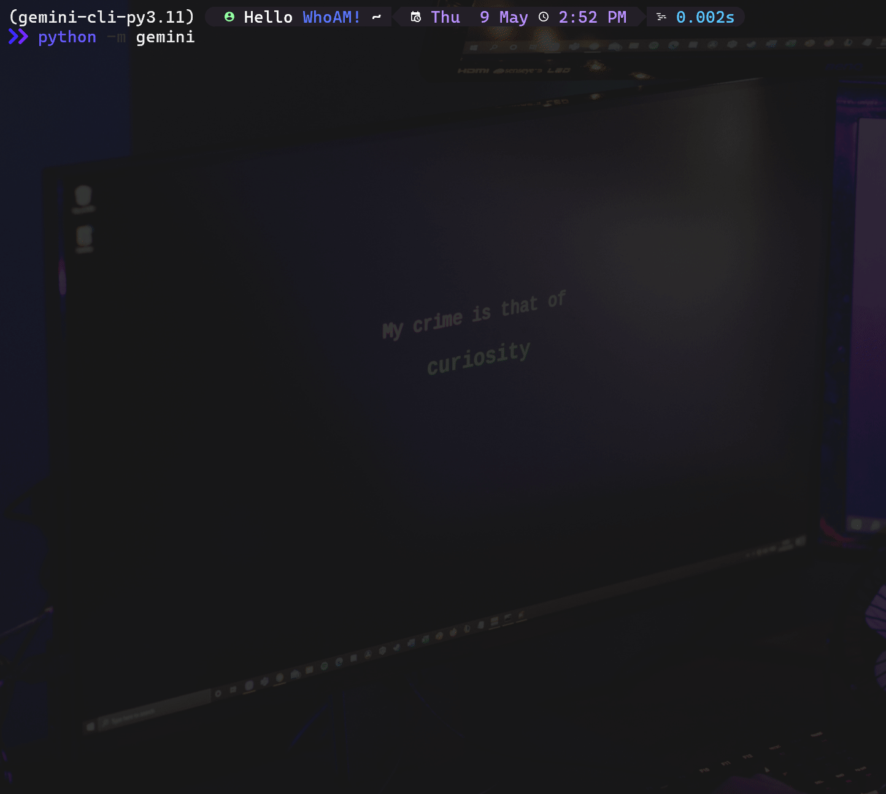

<div align='center'>

# Gemini-CLI 

**Gemini** CLI tool for interacting with Google's Gemini chatbot.



</div>

## **Installation**

**Using** _`poetry`_

```
git clone https://github.com/x404xx/Gemini-CLI.git
cd Gemini-CLI
poetry shell
poetry install
```

**Using** _`pip`_

```
git clone https://github.com/x404xx/Gemini-CLI.git
cd Gemini-CLI
virtualenv env
env/scripts/activate
pip install -r requirements.txt
```

## Authentication

Go to https://gemini.google.com/

-   Sign in with your google account
-   `F12` for console
-   **Firefox Session**: Go to Application → Cookies → `__Secure-1PSID` and `__Secure-1PSIDTS`. Copy the value of that cookie.

> **Note**
> After obtaining a `__Secure-1PSID` and `__Secure-1PSIDTS` you can save them somewhere and then run the program. By default, the program will ask you for a `__Secure-1PSID` and `__Secure-1PSIDTS` and make the JSON file automatically for you. Alternatively, you can create the **.env** or JSON file (_**gemini_cookies.json**_) manually.

Authenticate _**Gemini-CLI**_ with command-line ::

```bash
python -m gemini -s 'YOUR__Secure-1PSID' -st 'YOUR__Secure-1PSIDTS'
```

Alternatively, you can run _**Gemini-CLI**_ without command-line. It will prompt you for the input `__Secure-1PSID` and `__Secure-1PSIDTS` ::

```
python -m gemini
```

## Legal Disclaimer

> [!Note]
> This was made for educational purposes only, nobody which directly involved in this project is responsible for any damages caused. **_You are responsible for your actions._**
